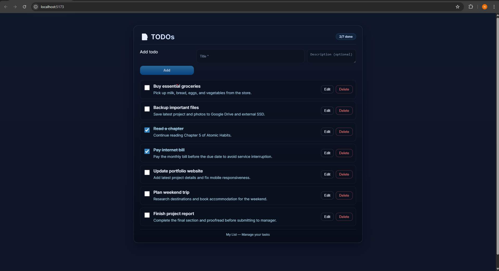
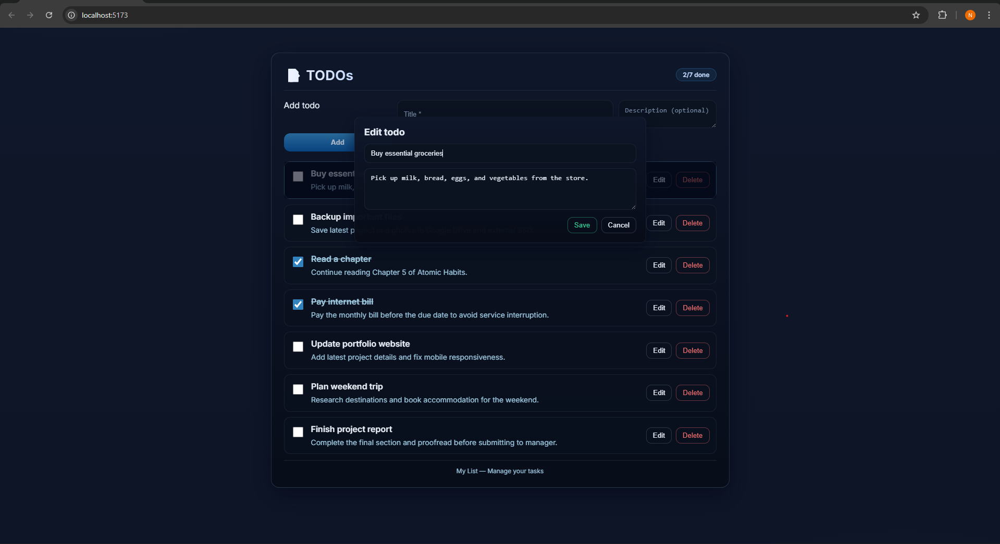

# TODO App — Frontend (React + Vite)

Simple TODO list frontend built with React, Vite and Redux Toolkit.

## Features

- Add, edit, toggle done/undone and delete todos
- Optimistic UI updates with temporary items
- Responsive layout and modal editing
- Minimal, dark themed UI

## Requirements

- Node.js 18+
- npm or yarn

## Install

From the client directory:

```bash
# using npm
npm install

# or using yarn
yarn
```

## Run (development)

```bash
# npm
npm run dev

# yarn
yarn dev
```

Open http://localhost:5173 (Vite default) to view the app.

## Build

```bash
# npm
npm run build

# yarn
yarn build
```

## Project structure (frontend)

- src/ — React source code
- public/screenshots — UI image assets used in README
- package.json — project scripts and dependencies

## Screenshots

List view:



Edit modal:



## Notes

- This README references static SVGs included in public/screenshots so they display in the repo and when served by Vite.
